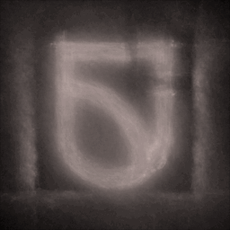
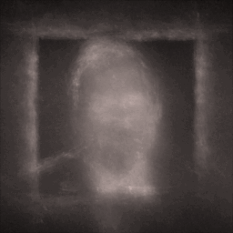
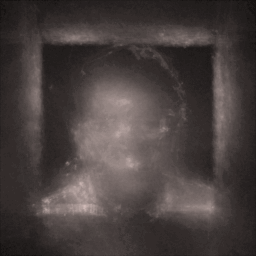
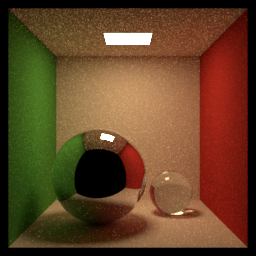
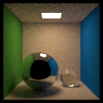

# Exploring Inverse Rendering
## Introduction
I was looking for an excuse to learn about inverse rendering, and this final project provided me with an excuse to do so. More specifically, I'll be reproducing [this](https://mitsuba.readthedocs.io/en/latest/src/inverse_rendering/caustics_optimization.html) from the Realistic
Graphics Lab (RGL) at EPFL, Switzerland.

Here's some results I rendered of caustic lenses produced with inverse rendering:

  

Skip to 4: Custom Caustics for the interesting stuff.
## 0: Installation
0_installation.ipynb contains the commands used to install mitsuba, drjit, and ipywidgets.
## 1: Hello World
1_hello world.ipynb contains the "Hello World" equivilent of graphics, rendering a cornell box.
## 2: Mitsuba Quickstart
2_mitsuba quickstart - Learned mitsuba features, such as variants. Downloaded scene files provided by mitsuba, then rendered a modified cornel box and saved it as a png file.

## 3: Gradient Based Optimization
3_gradient based optimization.ipynb - Sovled a basic gradient optimization problem. Began with rendering a cornell box, using the traverse command to show modifyable scene parameters, changed the wall colour, and re-rendered the scene.
Given an image of a cornell box and a cornell box scene with a modified wall colour, use gradient descent to restore the original wall colour.
Begin by selecting the scene paramaters to optimize (the wall colour). Render the scene, then compute the mean square error between the rendered image and original image. Use this difference to update the scene, then repeat until you reach a desired error threshold or number of iterations.

## 4: Custom Caustics
Here's an image of some caustics projected onto my desk:

I want to produce a lens that projects caustics in the shape of an image. Start by setting up the scene as follows: 

Use a hightmap to control the shape of the lens. Use gradient descent to optimize the hightmap.

Here's some visualizations of the lens shape being optimized:

  

## 5: Showcase
5_showcase.ipynb is some code I wrote to render a demonstration of the caustic lens moving in and out of the focal plane.

  